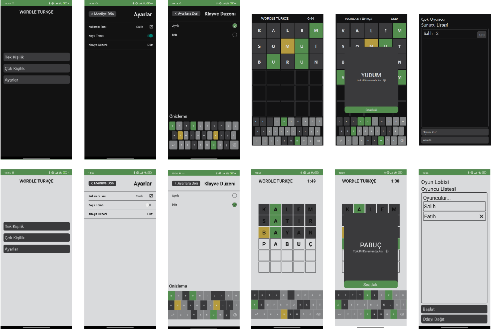

# Wordle Türkçe

<p align="center">
  
</p>

Wordle game played with Turkish words. The game can be played both single-player and multi-player.

Source of words: [ogun/guncel-turkce-sozluk](https://github.com/ogun/guncel-turkce-sozluk)

## Tech stack
- Expo Router
- Redux Toolkit
- Firebase Realtime Database
- Reanimated
- async-storage

## Get started

1. Install dependencies

   ```bash
   npm install
   ```

2. Create a new project in Firebase console. Create the real-time database in test mode

3. Rename the ".env.template" file to ".env.local"

4. Paste the address of your real-time database in the comment field

5. Start the app

   ```bash
    npx expo start
   ```

## Screens
